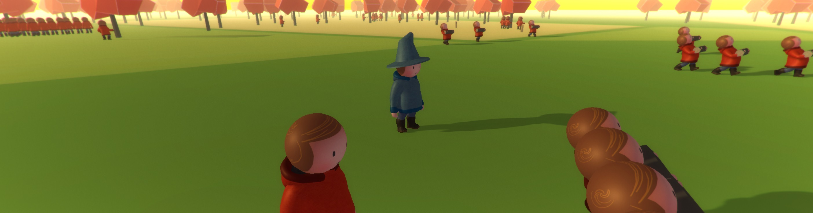

# Wizards! (SpatialOS)

*****

*Copyright (C) 2017 Improbable Worlds Limited. All rights reserved.*

- [Guide](https://docs.improbable.io/reference/latest/getting-started/tour/intro)
- *GitHub repository*: https://github.com/spatialos/Wizards/

*****

### Introduction

This repository contains a demo project built with [SpatialOS](http://www.spatialos.com).
It demonstrates how to use SpatialOS to build a large and compelling simulated world.

The project serves as a starting point for the [hands-on SpatialOS product demo](https://docs.improbable.io/reference/latest/getting-started/tour).

The main documentation for SpatialOS can be found [here](https://spatialos.improbable.io/docs/reference/latest/index).

If you run into problems, or want to give us feedback, please visit the [SpatialOS forums](https://forums.improbable.io/).

#### To use the repository

* Make sure you have access to SpatialOS
* Install dependencies for [Windows](https://spatialos.improbable.io/docs/reference/latest/setup-spatialos/win) or [Mac](https://spatialos.improbable.io/docs/reference/latest/setup-spatialos/mac)
* Clone the repo: `git clone https://github.com/spatialos/wizards`
* Move into the directory: `cd wizards`
* Build the project: `spatial worker build`
* To run locally:
* Run: `spatial local launch`
* Connect multiple player clients: `spatial local worker launch UnityClient default`
* To deploy in the cloud:
* Update spatialos.json: edit the "name" parameter from `your_project_name_here` to your spatialOS project name and save it
* Upload the assembly: run `spatial cloud upload my_wizards_assembly`
* Launch the deployment: run `spatial cloud launch my_wizards_assembly default_launch.json my_wizards_deployment --snapshot=./snapshots/default.snapshot`